# Analytics Pvt Ltd — Kubernetes Deployment Pipeline

I built this to take a product website from a `git push` all the way to a running,
load-balanced deployment on a Kubernetes cluster I provisioned and configured myself —
end to end, with production releases gated to a fixed monthly window instead of
deploying on every commit.

**[Live demo](https://burhan-hakim.github.io/analytics-k8s-deployment/demo/)**

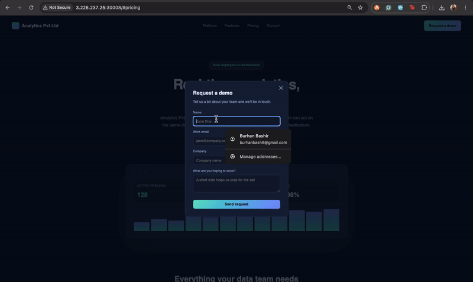

## What's actually happening here

Terraform stands up a 3-node cluster on AWS — one control plane, two workers. Ansible,
split into roles (`common`, `containerd`, `kubernetes`, `k8s_master`, `k8s_worker`),
bootstraps all three with kubeadm, containerd, and Calico for pod networking. Then two
Jenkins pipelines take over:

- **`analytics-build`** fires on every push to `master` — builds a Docker image and
  pushes it to Docker Hub. Continuous, no gatekeeping.
- **`analytics-release`** only runs on the 25th of the month, or manually. It's the one
  that actually touches production: pulls the latest built image, applies the
  Kubernetes manifests, and rolls the deployment.

That split exists because the actual requirement was "releases happen on a fixed
schedule," not "deploy whatever's on master right now." Those are different problems
and I didn't want to fake the second one by just... not testing it.

## Proving the schedule actually works

Writing `cron('0 2 25 * *')` into a Jenkinsfile and screenshotting it proves nothing —
anyone can type a cron expression that's never been tested. So I temporarily tightened
it to fire every 15 minutes, let it trigger on its own twice, confirmed the deploy
logic held up under a real scheduled run (not a manual "Build Now"), and then put the
production schedule back. Commit history has the whole before/during/after.

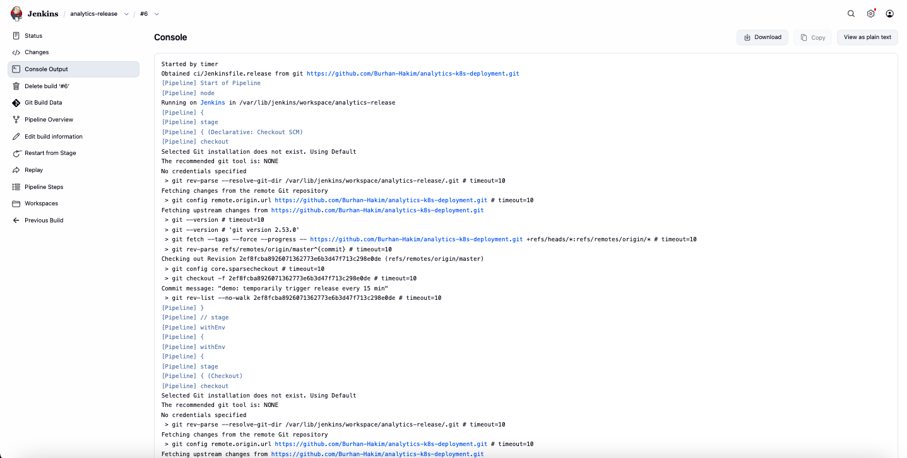
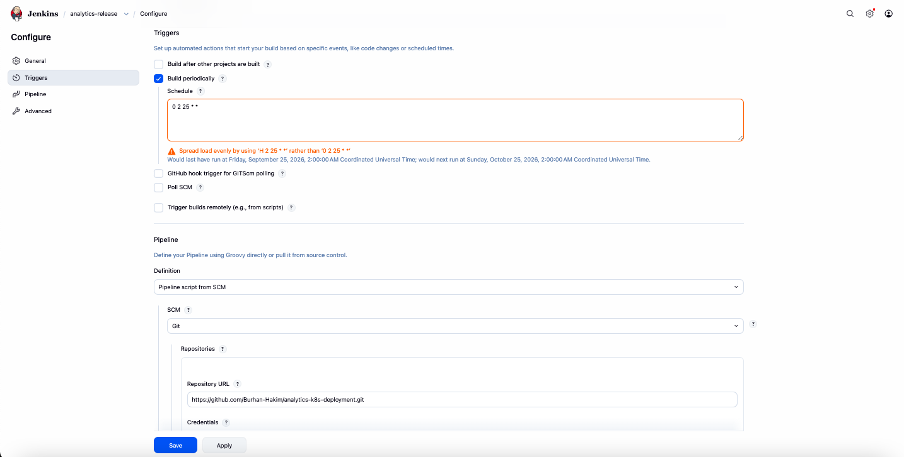

## Architecture

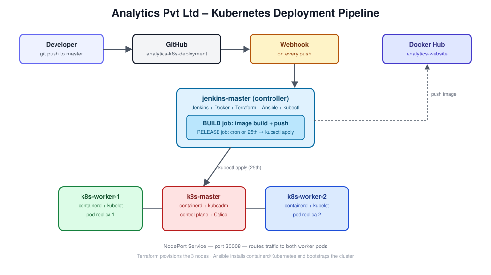

## Stack

AWS EC2 · Terraform · Ansible · Jenkins · Docker (`nginx:1.27-alpine`, non-root) ·
Kubernetes (kubeadm, containerd, Calico) · Docker Hub

## A bug worth mentioning

Early on, my control plane kept crash-looping right after `kubeadm init`. Took a while
to trace it back to a mismatch between containerd's cgroup driver and what kubelet
expected — a classic "everything looks fine until it very much isn't" problem. Fixed
it in the Ansible role and added a check that now fails the playbook immediately if
that mismatch ever happens again, instead of surfacing as a mysterious crash loop ten
minutes later.

## Screenshots

**Infrastructure stood up**
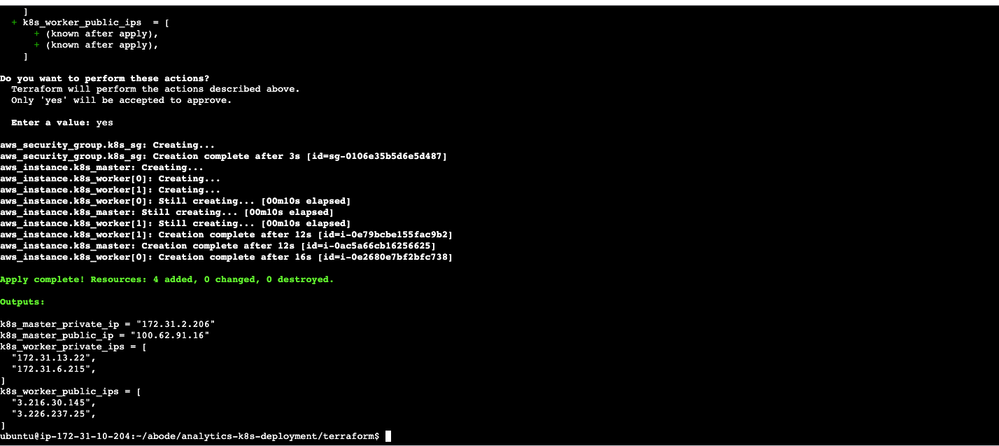

**Cluster healthy and holding steady**
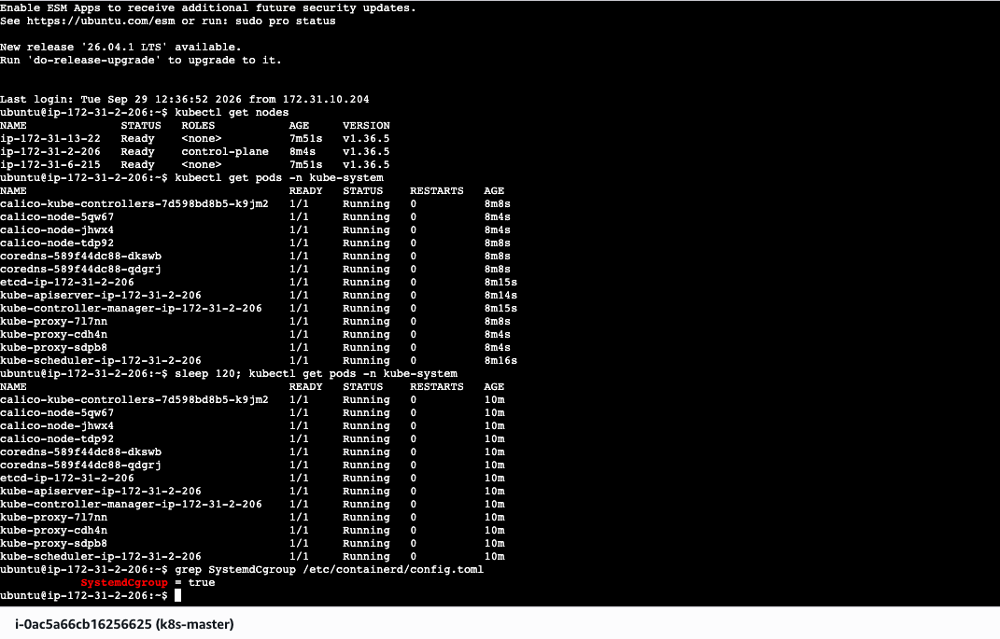

**Build triggered by an actual push, not a click**
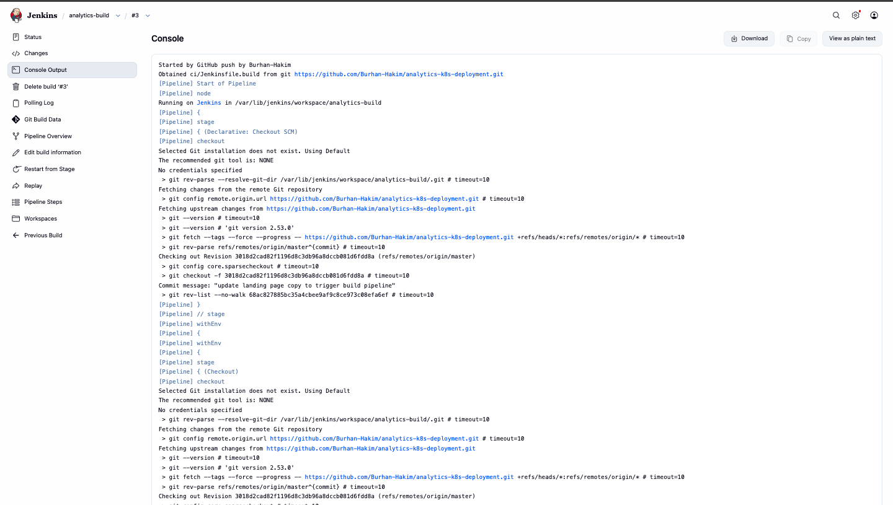

**Two replicas, spread across both workers**
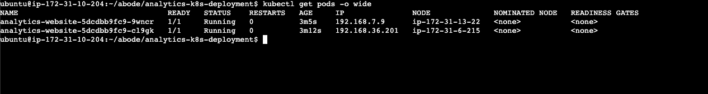

**Live, from both worker nodes**
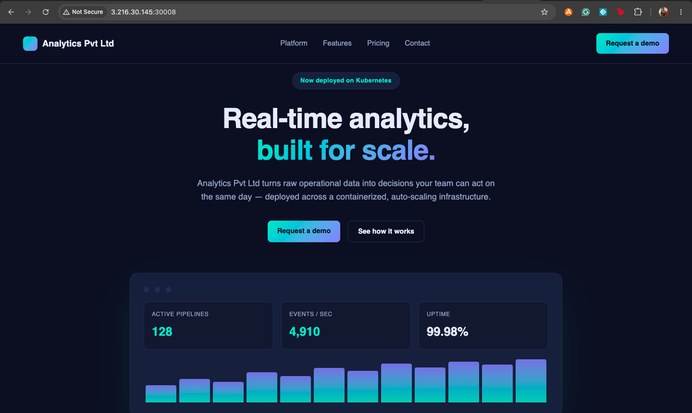

**Desktop and mobile**

| Desktop | Mobile |
|---|---|
| 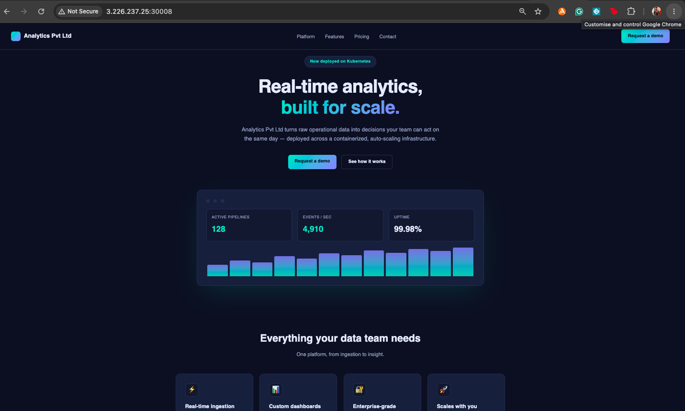 | 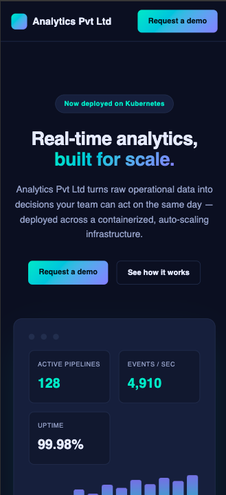 |

More screenshots covering every stage of the pipeline are in
[`docs/screenshots/`](docs/screenshots/).

## Running it yourself

1. `terraform init && terraform apply` in `terraform/`
2. Fill in `ansible/inventory/hosts.ini` with the resulting node IPs, then
   `ansible-playbook site.yml`
3. In Jenkins, add `dockerhub` and `kubeconfig` credentials, create two pipeline jobs
   pointing at `ci/Jenkinsfile.build` and `ci/Jenkinsfile.release`
4. Add a GitHub webhook to `http://<jenkins-ip>:8080/github-webhook/`
5. Push to `master` — the build pipeline runs on its own

## What I'd add next

Ingress with real TLS instead of a bare NodePort, a `HorizontalPodAutoscaler` (resource
requests/limits are already set, so this is most of the way there), and a staging
namespace so continuous builds land somewhere testable before the monthly release
actually ships them.

---

**Burhan Hakim** · [LinkedIn](https://www.linkedin.com/in/burhan-bashir-hakim-48a8a3225) · [GitHub](https://github.com/Burhan-Hakim)
